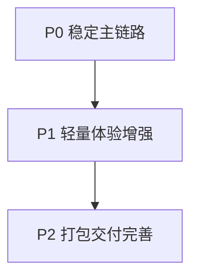

# LiteObsidian 后续开发任务文档

这份文档按你当前仓库的真实进度来排后续任务，目标是先把轻量版 Obsidian 做到好用和稳定，不追求复杂功能。

## 1. 当前进度盘点

### 1.1 已经完成

- Web 端路由和页面骨架已经有了，首页和详情页可访问。
- Android 壳和 `WebView` 已打通，`hybrid.invoke` 协议可用。
- SQLite `notes` 表和索引已落地，Java 侧 CRUD 已实现。
- 前端通过桥接可以完成 新建 读取 保存 删除 的主流程。
- `HashRouter` 和 Vite 相对路径配置已经适配离线包。

### 1.2 现在的主要短板

- 详情页还是纯文本编辑，没有 Markdown 预览体验。
- 首页没有搜索和排序切换，笔记多了以后不好找。
- 自动保存和编辑状态提示还没有，容易让人不确定有没有保存成功。
- 还没有一键同步 `web/dist` 到 Android assets 的脚本。
- 缺少最基本的联调自测清单和回归检查动作。

## 2. 开发目标

- 先把核心体验做顺，围绕 列表 编辑 预览 保存 这条主链路。
- 所有任务都要保持本地离线可用，不引入后端。
- 不做插件系统、云同步、图谱视图这些复杂功能。

## 3. 迭代计划

### 3.1 P0 稳定主链路（优先级最高）

1. 统一保存行为和反馈  
验收标准：新建和编辑都走同一套保存逻辑，保存中按钮禁用，成功和失败提示清晰。

2. 增加未保存离开提醒  
验收标准：编辑内容有变更时，返回首页或切路由会提示是否离开，防止误操作丢内容。

3. 首页空状态和异常状态完善  
验收标准：无笔记时有明确引导文案，桥接异常时能看到可理解的提示。

4. 删除前二次确认  
验收标准：点击删除先弹确认框，确认后才真正调用删除接口。

### 3.2 P1 轻量体验增强

1. Markdown 预览模式  
建议做法：详情页增加 编辑 预览 切换，不做分屏。  
验收标准：支持常用 Markdown 语法，标题 列表 代码块可正常显示。

2. 自动保存  
建议做法：输入停止一段时间后自动保存，手动保存按钮保留。  
验收标准：自动保存成功后有轻提示，失败时可重试，且不会频繁抖动保存。

3. 首页关键词搜索  
建议做法：先做标题和正文的 `LIKE` 搜索，不做复杂索引优化。  
验收标准：输入关键词后列表实时刷新，清空关键词后恢复全量列表。

4. 最近更新时间展示优化  
验收标准：列表项展示友好的时间文本，排序保持按更新时间倒序。

### 3.3 P2 打包交付完善

1. 增加 `dist` 同步脚本  
验收标准：一条命令完成 `web build` 和拷贝到 `android/app/src/main/assets/dist`。

2. 增加最小回归检查清单  
验收标准：文档化 10 条以内的手工检查点，覆盖 启动 列表 新建 编辑 删除 重启保留。

3. README 更新  
验收标准：新同学按 README 可以在本机跑通，不需要口头补充步骤。

## 4. 任务清单

| 编号 | 任务 | 优先级 | 预计工作量 | 依赖 |
|------|------|--------|------------|------|
| T1 | 保存状态统一和提示优化 | P0 | 0.5 天 | 无 |
| T2 | 未保存离开提醒 | P0 | 0.5 天 | T1 |
| T3 | 删除二次确认 | P0 | 0.5 天 | 无 |
| T4 | 空状态和异常状态文案 | P0 | 0.5 天 | 无 |
| T5 | Markdown 预览模式 | P1 | 1 天 | T1 |
| T6 | 自动保存 | P1 | 1 天 | T1 |
| T7 | 关键词搜索 | P1 | 1 天 | 现有 list 接口 |
| T8 | 时间展示优化 | P1 | 0.5 天 | 无 |
| T9 | 构建拷贝脚本 | P2 | 0.5 天 | 无 |
| T10 | 回归清单和 README 更新 | P2 | 0.5 天 | T9 |

## 5. 建议分工

- 同学 A：Android 和桥接相关任务，重点是搜索接口和打包脚本联动。
- 同学 B：详情页体验相关任务，重点是预览 自动保存 离开提醒。
- 同学 C：列表体验和文档交付，重点是搜索列表 时间展示 自测清单 README。

## 6. 每个阶段的验收口径

### P0 验收口径

- 不出现明显误删和误退出导致的数据丢失。
- 新建 编辑 删除 都有清晰反馈。
- 异常状态下页面不会卡死或白屏。

### P1 验收口径

- 详情页可在编辑和预览之间稳定切换。
- 自动保存行为可预期，不会频繁误触发。
- 笔记数量到几十条时，仍能快速定位内容。

### P2 验收口径

- 一次命令可完成前端产物同步。
- 新同学按文档可独立跑通并完成演示。

## 7. 本轮明确不做

- 云同步和账号体系
- 插件系统
- 双向链接图谱
- 附件管理和复杂文件系统映射

以上先不做，后面如果课程有加分时间，再单独开分支补。
